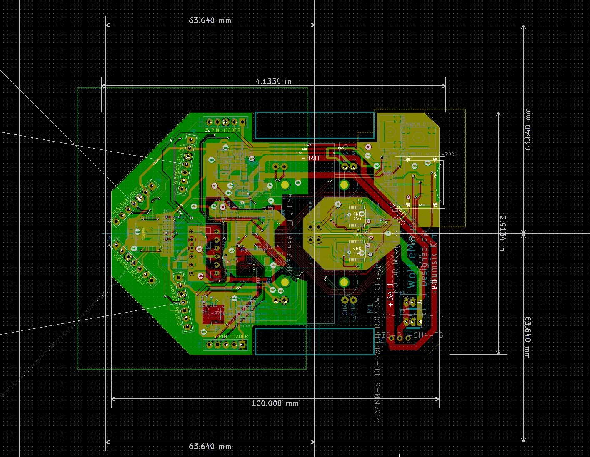

# Hardware Design

* Design reference: [Project Futura](http://micromouseusa.com/?page_id=1342)

## WolfieMouse v1.0

The basic ideas of our first mouse is following:

> Use as many digital components as possible, to eliminate design concerns on analog

To observe the ideas above, the micromouse features:

* STM32F446RET 32-bit ARM Cortex-M Microcontroller @180MHz
  * 512kB of Flash, 128kB of SRAM
  * One of the fastest microcontroller for 64-pin package
* VL6180X ToF Range sensor \*3 (or \*4)
  * Eliminates analog concern of Infrad LEDs/Phototransistors combo
  * Use PCA9546A I2C multiplexer to communicate between 4 indentical sensors
* MAX14871 full-bridge DC motor driver \*2
  * Avoids electrical and timing issues on H-bridge and MOFSET design
* Micro SD card reader
  * Easy to log and read data for designers, instead of use of SPI memory
* 4 Character LED display
* MPU9250 digital Inertial Measurement Unit (IMU)
* 5:1 Micro Metal Gearmotor HP by Polou *2
  * AS5304A magnetic encoder & AS5000-MR20-44 magnetic ring combo for rotary encoder of each motors

### Gallery of WolfieMouse 1.0

Schematic overview. See the whole schemetic [here (PDF).](hardware_design/schematic_2017_Feb.pdf) 

PCB Footprint overview. Use [KiCad](http://kicad-pcb.org/) and open `hardware` dicrectory to see footprint.

## WolfieMouse v2.0

### What need to fixed from v1.0

1. The bed for motor is somewhat high - we need to make it lower.
2. Some part didn't work well due to bad soldering

### Design Goal

1. [Replace range sensor](#Range-sensor)
2. Add a buzzer
3. Add a bluetooth device
4. Try using back side of the board
5. Minor changes like changing position of chips

### Range sensor

* [A perfect description on designing range sensor](http://micromouseusa.com/wp-content/uploads/2014/02/lecture-5-Parts_design-choicespart1.pptx)

#### Parts candidate

* Emitter
  * SFH4550, 850nm: [Datasheet](http://www.osram-os.com/Graphics/XPic7/00209835_0.pdf)
  , [Digi-key](http://www.digikey.com/product-detail/en/osram-opto-semiconductors-inc/SFH-4550/475-1200-ND/806365)
  * SFH4555, 850nm: [Datasheet](http://www.osram-os.com/Graphics/XPic6/00209799_0.pdf)
  , [Digi-key](http://www.digikey.com/product-detail/en/osram-opto-semiconductors-inc/SFH-4555/475-3023-ND/2205957)
  * SFH4545, 925nm: [Datasheet](http://www.osram-os.com/Graphics/XPic4/00209805_0.pdf),
  [Digi-key](http://www.digikey.com/product-detail/en/osram-opto-semiconductors-inc/SFH-4545/475-2919-ND/2205955)
* Phototransistor
  * BPW85B, 850nm: [Datasheet](http://www.vishay.com/docs/81531/bpw85a.pdf)
  [Digi-key](http://www.digikey.com/product-detail/en/vishay-semiconductor-opto-division/BPW85B/BPW85B-ND/4071265)
  * TEFT4300, 925nm: [Datasheet](http://www.vishay.com/docs/81549/teft4300.pdf)
  [Digi-key](http://www.digikey.com/product-detail/en/vishay-semiconductor-opto-division/TEFT4300/751-1041-ND/1681175)

### Buzzer

### Bluetooth

### Minor Changes

